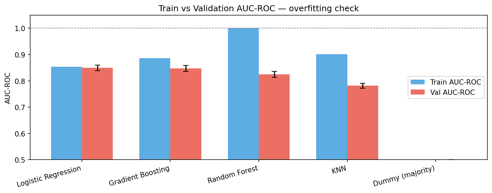
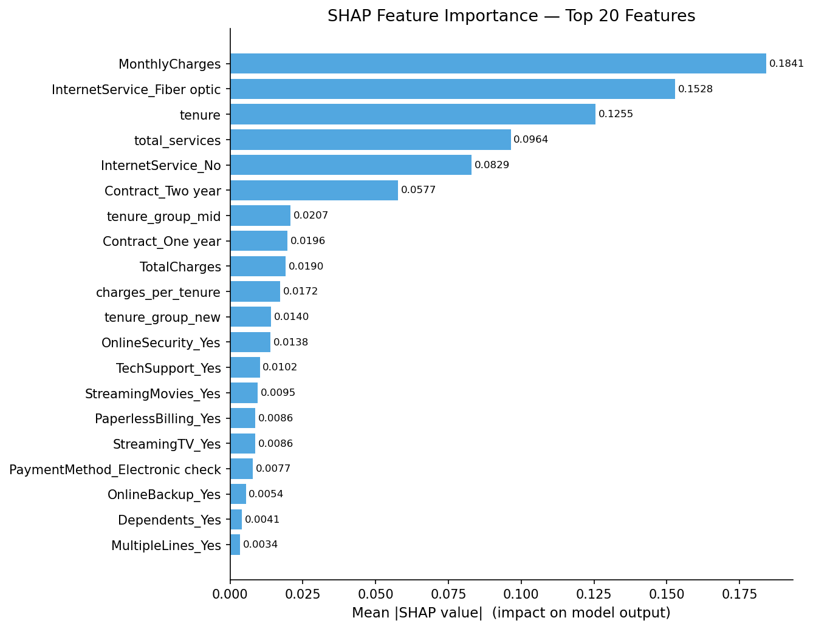

<div align="center">

# churn-lens

**A leakage-aware customer churn prediction pipeline — where the simplest model won.**

[](https://www.python.org/)
[](https://scikit-learn.org/)
[](https://github.com/shap/shap)
[](https://pandas.pydata.org/)
[](LICENSE)
[](https://github.com/psf/black)

<sub>AUC-ROC <b>0.8449</b> · catches <b>~79%</b> of churners · SHAP-explained · reproducible end-to-end</sub>

</div>

---

## TL;DR

A staged, **leakage-aware ML pipeline** for telecom churn — EDA → preprocessing → model selection → evaluation & explainability — on the Telco Customer Churn dataset (7,043 customers).

**The headline isn't the accuracy — it's the model that won.** A tuned **Logistic Regression** beat Random Forest and Gradient Boosting, not because it scored highest on paper but because it was the only candidate that *generalized cleanly*. Random Forest hit a train AUC-ROC of **0.9999** against a cross-validated **0.8246** — a textbook overfitting signature (an 18-point gap). Logistic Regression's train and validation scores were nearly identical (0.8536 vs 0.8491), meaning it learned signal rather than memorizing noise. **Picking the simpler model here was a judgment call, not a default.**

---

## Results

Evaluated once on **1,409 held-out test customers**, never touched during training or tuning.

| Metric | Value |
|---|:---:|
| **AUC-ROC** | **0.8449** |
| Average Precision | 0.6592 |
| Accuracy | 0.74 |
| Churn Recall *(@ threshold 0.577)* | **0.786** |
| Churn Precision *(@ threshold 0.577)* | 0.505 |
| Churn F1 *(@ threshold 0.577)* | 0.615 |

The model catches **~79% of customers who actually churn**, at the cost of roughly one false alarm per correct flag. That trade-off is deliberate: the pipeline uses `class_weight="balanced"` on the reasoning that a *missed* churner costs more than an unnecessary retention offer.

<div align="center">

<br><sub><b>Why Logistic Regression won:</b> Random Forest's near-perfect training score against a far lower validation score is the overfitting tell.</sub>
</div>

---

## Model Selection

5-fold stratified cross-validation on the training data:

| Model | CV AUC-ROC | Train AUC-ROC | Train/CV Gap |
|---|:---:|:---:|:---:|
| **Logistic Regression** | **0.8491 ± 0.011** | 0.8536 | **0.0045** |
| Gradient Boosting | 0.8475 ± 0.011 | 0.8859 | 0.0384 |
| Random Forest | 0.8246 ± 0.011 | 0.9999 | 0.1753 |
| KNN | 0.7816 ± 0.010 | 0.9009 | 0.1193 |
| Dummy *(baseline)* | 0.5000 | 0.5000 | — |

Tuning (`GridSearchCV` over `C`, `penalty`, `solver`) moved CV AUC-ROC only marginally (0.8491 → 0.8493), landing on `C=10, penalty='l2', solver='liblinear'`.

---

## What Drives Churn (SHAP)

| Rank | Feature | Mean \|SHAP\| |
|:---:|---|:---:|
| 1 | MonthlyCharges | 0.190 |
| 2 | InternetService = Fiber optic | 0.155 |
| 3 | tenure | 0.121 |
| 4 | total_services *(engineered)* | 0.096 |
| 5 | InternetService = No | 0.081 |

Billing amount, internet plan type, and tenure dominate, with contract length as a secondary protective signal. The engineered `total_services` feature ranking 4th confirms "number of subscribed services" as a genuine stickiness proxy.

<div align="center">

</div>

---

## Why This Isn't a Typical Churn Project

Most Telco-churn portfolios load the CSV, one-hot everything, fit a `RandomForestClassifier`, print accuracy, and stop. This one is engineered around what actually gets screened for in ML/AI hiring:

- **Leakage discipline enforced structurally** — `ColumnTransformer` fit on `X_train` only; `03_evaluate.py` never loads the training set; hyperparameter search nested inside CV so the test set stays untouched.
- **Imbalance handled by reasoning, not reflex** — SMOTE explicitly considered and rejected in favor of stratified splits + `class_weight="balanced"` + AUC-ROC/PR metrics.
- **Decision threshold treated as a business lever** — precision/recall/F1 swept across all thresholds, framed by the real cost asymmetry rather than defaulting to 0.5.
- **Model-aware explainability** — SHAP explainer branches on model type (`TreeExplainer` vs `KernelExplainer`) instead of impurity-based importance, showing both *what* matters and *how*.
- **Structured like production code** — config-driven scripts, integrity assertions, reconstructed feature names after encoding, JSON artifacts built to feed a downstream API/dashboard.

---

## Project Structure

```
.
├── data/
│   ├── raw/Telco_Data.csv          # source dataset (7043 × 21)
│   └── processed/                  # df_clean.csv + train/test splits
├── notebooks/
│   └── EDA.ipynb                   # Stage 1–6 exploratory analysis + cleaning
├── src/
│   ├── 01_preprocessing.py         # feature engineering + split + encoding
│   ├── 02_train_crossval.py        # model comparison + hyperparameter tuning
│   └── 03_evaluate.py              # test-set eval, curves, SHAP
├── models/                         # fitted pipeline + best_model.pkl
└── reports/                        # plots (01–14) + JSON/CSV summaries
```

---

## Quickstart

```bash
git clone https://github.com/Nabil-Haddad/churn-lens.git
cd churn-lens

python -m venv .venv && source .venv/bin/activate   # or conda
pip install -r requirements.txt

python src/01_preprocessing.py             # feature engineering, split, encoding
python "src/02_train crossval.py"          # model selection + tuning -> best_model.pkl
python src/03_evaluate.py                  # test-set eval + curves + SHAP
```

`random_state=42` is fixed throughout, so an end-to-end re-run reproduces the exact numbers above.

---

## Dataset

[Telco Customer Churn](https://www.kaggle.com/datasets/blastchar/telco-customer-churn) — 7,043 customers, 26.5% churn rate. Full methodology (EDA stages, cleaning decisions, design rationale) in [`PROJECT_SUMMARY.md`](reports/PROJECT_SUMMARY.md).

---
